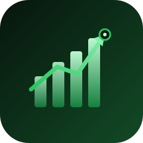
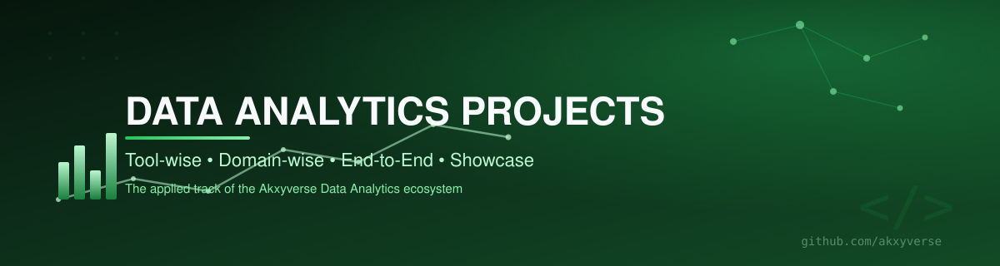

  

  

### Where theory turns into evidence.
### Real projects, organized by tool and by domain — not a folder of half-finished notebooks.

 

<table>
<tr>
<td width="25%" align="center" valign="top">

**🧭 What**

Every hands-on Data Analytics project I've shipped, organized two ways at once.

</td>
<td width="25%" align="center" valign="top">

**💡 Why**

A project only proves a skill if it's findable. Tool-wise *and* domain-wise indexing means it always is.

</td>
<td width="25%" align="center" valign="top">

**👥 Who**

Recruiters wanting evidence, not claims — and learners looking for project structure ideas.

</td>
<td width="25%" align="center" valign="top">

**🎁 Value**

A ready template for organizing your own portfolio by tool and by industry.

</td>
</tr>
</table>

### 🧭 Explore the Ecosystem

<table>
<tr>
<td align="center" width="12.5%"><a href="https://github.com/akxyverse"><b>🏠</b> Profile</a></td>
<td align="center" width="12.5%"><a href="https://github.com/akxyverse/data-analytics-knowledge-system"><b>🧠</b> Knowledge Hub</a></td>
<td align="center" width="12.5%"><b>🚀</b> Projects</td>
<td align="center" width="12.5%"><a href="https://github.com/akxyverse/datasets"><b>📦</b> Datasets</a></td>
<td align="center" width="12.5%"><a href="https://github.com/akxyverse/data-analytics-resources"><b>📚</b> Resources</a></td>
<td align="center" width="12.5%"><a href="https://github.com/akxyverse/career-hub"><b>💼</b> Career</a></td>
<td align="center" width="12.5%"><a href="https://github.com/akxyverse/content-studio"><b>✍️</b> Content</a></td>
<td align="center" width="12.5%"><a href="https://github.com/akxyverse/certifications"><b>🏅</b> Certs</a></td>
</tr>
</table>

<a href="https://github.com/akxyverse/ai-automation"><b>🤖 AI Automation</b></a> — AI/agentic projects live in their own dedicated repository

---

## 🌟 Live Projects

<table>
<tr>
<td width="50%" valign="top">

**⚡ [ThunderCast: Storm Forecasting Platform](https://github.com/akxyverse/ThunderCast-Storm-Forecasting-Platform)**
Real-time thunderstorm prediction using Facebook Prophet time-series forecasting, live weather API, Streamlit dashboard.
`Python` `Prophet` `Streamlit` &nbsp;[🔗 Live Demo](https://akxyverse-thundercast-smart-storm-predictio-dashboardapp-xqeckf.streamlit.app/)

</td>
<td width="50%" valign="top">

**📦 [Supply Chain Analytics Dashboard](https://github.com/akxyverse/Supply-chain-analytics-Dashboard)**
43K+ delivery records, 30+ visualizations, KPI metrics on delivery performance and agent efficiency.
`Python` `Streamlit` &nbsp;[🔗 Live Demo](https://supply-chain-analytics-system-5tlaustxwavffqjplsgutw.streamlit.app/)

</td>
</tr>
<tr>
<td width="50%" valign="top" colspan="2">

**🎮 [Esports & Gaming Revenue Analytics](https://github.com/akxyverse/Esports-Gaming-Revenue-Analytics)**
16 years of gaming/esports revenue across 25 countries — 17.7% CAGR, interactive Tableau dashboard.
`Python` `Tableau` `EDA` &nbsp;[🔗 Live Dashboard](https://public.tableau.com/views/GamingEsportsSalesAnalyticsDasboard/GamingEsportsRevenueAnalyticsDashboard20102025?:language=en-US&publish=yes&:sid=&:redirect=auth&:display_count=n&:origin=viz_share_link)

</td>
</tr>
</table>

> These are references to standalone repositories — the code lives at the links above, not duplicated here. See where each one is categorized below.

## 🗂 Project Categories

<table>
<tr>
<td width="50%" valign="top">

### 🧰 Tool-wise Projects
Organized by primary tool used.

**Categories:** Python · SQL · Power BI · Tableau (Esports project) · Excel · Machine Learning · Deep Learning · Generative AI · Agentic AI · Data Engineering · Cloud

📂 [Open folder](<./Tool-wise Projects>)

</td>
<td width="50%" valign="top">

### 🌍 Domain-wise Projects
Organized by industry solved for.

**Categories:** Healthcare · Finance · Retail · Manufacturing · Sales · Marketing · HR · **Logistics** (Supply Chain project) · Education · Banking · Insurance · Real Estate · Ecommerce · **Others** (Esports project)

📂 [Open folder](<./Domain-wise Projects>)

</td>
</tr>
<tr>
<td width="50%" valign="top">

### 🔗 End-to-End Projects
Full pipeline: ingestion → cleaning → model/analysis → dashboard. Includes **ThunderCast**.

📂 [Open folder](<./End-to-End Projects>)

</td>
<td width="50%" valign="top">

### 🏆 Showcase Projects
Portfolio-ready, polished, live-demo-having work. Includes **all 3 live projects** above.

📂 [Open folder](<./Showcase Projects>)

</td>
</tr>
<tr>
<td width="50%" valign="top">

### 🧩 Business Problems
Case-study style problems, framed and solved with data.

📂 [Open folder](<./Business Problems>)

</td>
<td width="50%" valign="top">

### 📐 Project Templates
Reusable starting structure for new projects — consistent README, folder layout, and conventions.

📂 [Open folder](<./Project Templates>)

</td>
</tr>
</table>

## 🎯 How to Use This Repository

1. **Know the tool?** Browse [`Tool-wise Projects`](<./Tool-wise Projects>).
2. **Know the industry?** Browse [`Domain-wise Projects`](<./Domain-wise Projects>).
3. **Want the best of the best?** [`Showcase Projects`](<./Showcase Projects>) is the curated highlight reel.
4. **Starting a new project?** [`Project Templates`](<./Project Templates>) gives you the standard structure.

## 🟢 Status

Structure is in place; 3 projects currently referenced, more shipping over time. Datasets used by these projects live in the separate [`Datasets`](https://github.com/akxyverse/datasets) repository — referenced, not duplicated.

## ➡️ Recommended Next Repository

### 📦 [Datasets](https://github.com/akxyverse/datasets)
**See what powers these projects.** Every dataset used above has a permanent, organized home there.

---

**⭐ Star this repo if the structure is useful to you.**

Part of the <a href="https://github.com/akxyverse"><b>Akxyverse</b></a> Data Analytics ecosystem · MIT Licensed · <a href="./LICENSE">LICENSE</a>

